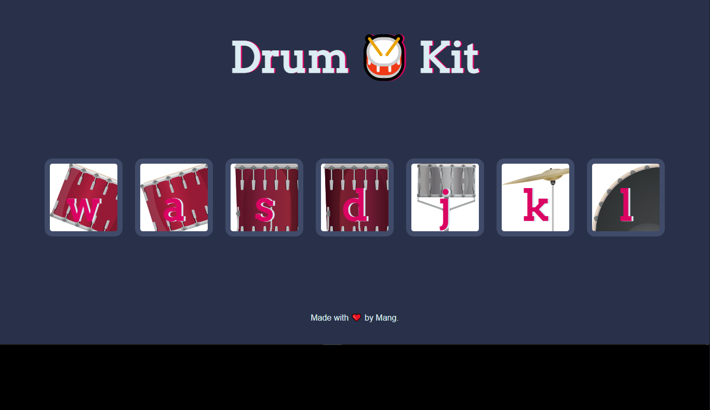

### Drum kit 
-----
Drum kit app in which player can make a corresponding drum noise by pressing each of the diplay key

      
 

### Things Learn from the project
- HTML   
     
- CSS  

- javaScript -    
-    
 
### ScreenShot

**Responsive and Mobile friendly**